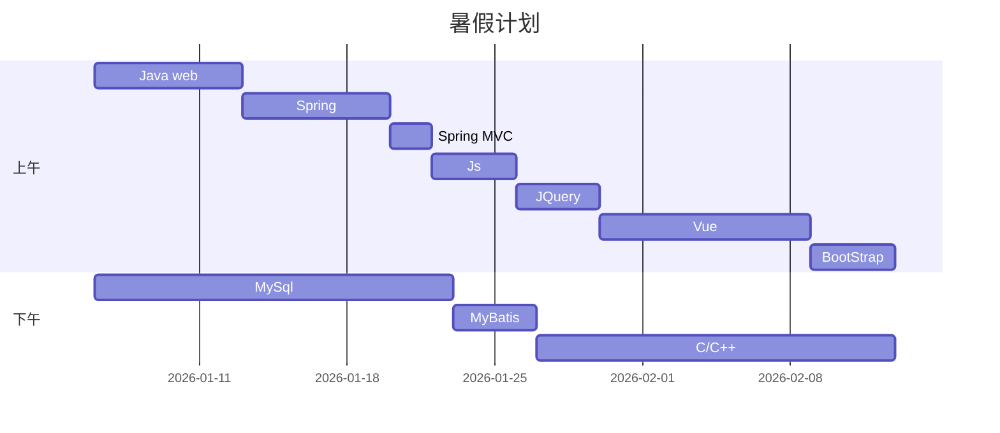

# markdown

```mermaid
gantt
	dateFormat MM-DD
	 title 暑假计划
        section 上午
        Java web:des11, 01-06,7d
        Spring:des12, after des11, 7d
        Spring MVC:des13, after des12, 2d
        Js:des14, after des13,4d
        JQuery:des15,after des14,4d
        Vue:des16,after des15,10d
        BootStrap:des17, after des16, 4d
        section 下午
        MySql:des21, 01-06, 17d
        MyBatis:des22, after des21, 4d
        C/C++:des23,after des22,17d
```

