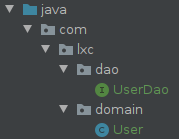
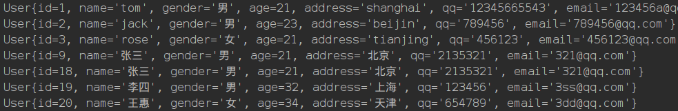

 ## Mybatis注解开发环境配置

#### pom.xml

```xml
<?xml version="1.0" encoding="UTF-8"?>
<project xmlns="http://maven.apache.org/POM/4.0.0"
         xmlns:xsi="http://www.w3.org/2001/XMLSchema-instance"
         xsi:schemaLocation="http://maven.apache.org/POM/4.0.0 http://maven.apache.org/xsd/maven-4.0.0.xsd">
    <modelVersion>4.0.0</modelVersion>

    <groupId>org.example</groupId>
    <artifactId>TestDemo1</artifactId>
    <version>1.0-SNAPSHOT</version>
    <packaging>jar</packaging>

    <dependencies>
        <!--        spring-->
        <dependency>
            <groupId>org.springframework</groupId>
            <artifactId>spring-context</artifactId>
            <version>5.2.3.RELEASE</version>
        </dependency>
        <!--        单元测试-->
        <dependency>
            <groupId>junit</groupId>
            <artifactId>junit</artifactId>
            <version>4.12</version>
            <scope>compile</scope>
        </dependency>
        <!--        spring测试-->
        <dependency>
            <groupId>org.springframework</groupId>
            <artifactId>spring-test</artifactId>
            <version>5.2.3.RELEASE</version>
            <scope>compile</scope>
        </dependency>
        <!--        数据库连接-->
        <dependency>
            <groupId>mysql</groupId>
            <artifactId>mysql-connector-java</artifactId>
            <version>5.1.6</version>
        </dependency>
        <!--        mybatis-->
        <dependency>
            <groupId>org.mybatis</groupId>
            <artifactId>mybatis</artifactId>
            <version>3.4.5</version>
        </dependency>
        <!--        日志-->
        <dependency>
            <groupId>log4j</groupId>
            <artifactId>log4j</artifactId>
            <version>1.2.12</version>
        </dependency>
        <!--        spring-jdbc-->
        <dependency>
            <groupId>org.springframework</groupId>
            <artifactId>spring-jdbc</artifactId>
            <version>5.2.3.RELEASE</version>
        </dependency>

        <dependency>
            <groupId>org.mybatis</groupId>
            <artifactId>mybatis-spring</artifactId>
            <version>1.3.0</version>
        </dependency>
    </dependencies>

</project>
```

#### bean.xml

```xml
<?xml version="1.0" encoding="UTF-8"?>
<beans xmlns="http://www.springframework.org/schema/beans"
       xmlns:xsi="http://www.w3.org/2001/XMLSchema-instance"
       xmlns:context="http://www.springframework.org/schema/context"
       xsi:schemaLocation="http://www.springframework.org/schema/beans
        https://www.springframework.org/schema/beans/spring-beans.xsd
        http://www.springframework.org/schema/context
        https://www.springframework.org/schema/context/spring-context.xsd">
    
    <context:component-scan base-package="com.lxc.service"></context:component-scan>

    <!--Spring整合MyBatis框架-->
    <!--配置连接池-->
    <bean id="dataSource"
          class="org.springframework.jdbc.datasource.DriverManagerDataSource">
        <property name="driverClassName" value="com.mysql.jdbc.Driver" />
        <property name="url" value="jdbc:mysql://127.0.0.1:3306/study1?useUnicode=true&amp;characterEncoding=utf8&amp;useSSL=false" />
        <property name="username" value="root" />
        <property name="password" value="23122918lxc" />
    </bean>

    <!--配置SqlSessionFactory工厂-->
    <bean id="sqlSessionFactory" class="org.mybatis.spring.SqlSessionFactoryBean">
        <property name="dataSource" ref="dataSource" />
    </bean>

    <!--配置AccountDao接口所在包-->
    <bean id="mapperScanner" class="org.mybatis.spring.mapper.MapperScannerConfigurer">
        <property name="basePackage" value="com.lxc.dao"/>
    </bean>

    <!--配置Spring框架声明式事务管理-->
    <!--配置事务管理器-->
    <bean id="transactionManager" class="org.springframework.jdbc.datasource.DataSourceTransactionManager">
        <property name="dataSource" ref="dataSource" />
    </bean>

</beans>
```

#### 包结构

.

#### User.java

```java
public class User implements Serializable {

    private int id;
    private String name;
    private String gender;
    private int age;
    private String address;
    private String qq;
    private String email;
    
    geter and seter
    .....
        
}
```

#### UserDao.java

```java
public interface UserDao {

    @Select("select * from user;")
    List<User> findAllUser();

}
```

#### 测试类

```java
@RunWith(SpringJUnit4ClassRunner.class)
@ContextConfiguration(locations = { "classpath*:bean.xml" })
public class Test1 {

    @Autowired
    UserDao userDao = null;

    @Test
    public void test(){
        List<User> allUser = userDao.findAllUser();
        for (User u:allUser){
            System.out.println(u.toString());
        }
    }

}
```

#### 运行结果

.

