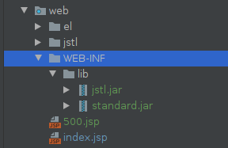
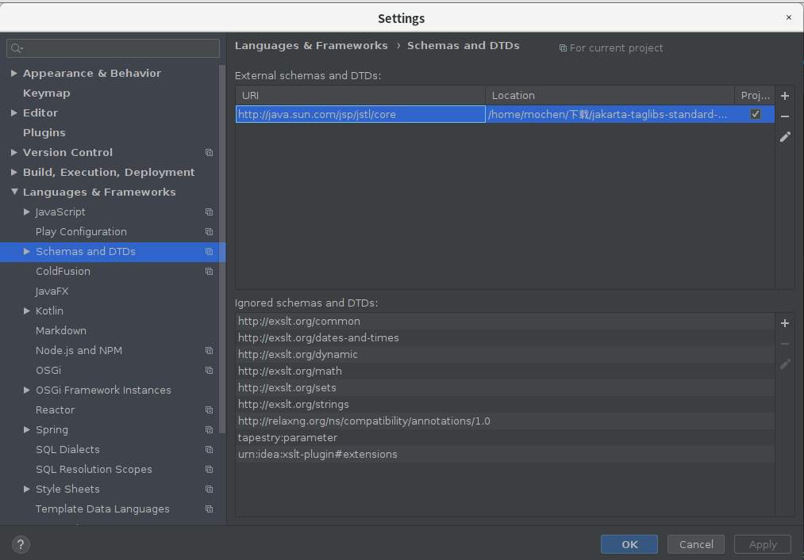
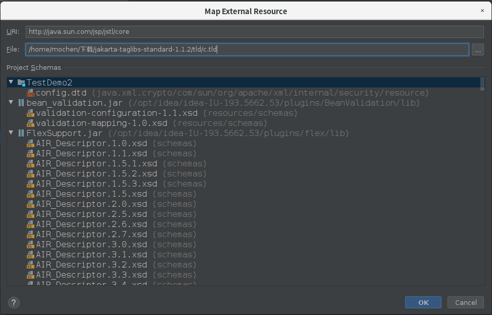

## 解决idea中jsp引入jstl标签库问题

#### 一、下载jar包

- 地址：http://archive.apache.org/dist/jakarta/taglibs/standard/binaries/
- 选择jakarta-taglibs-standard-1.1.2.zip下载
- 解压文件
- 将解压后的lib目录下的两个jar包添加到自己的项目lib目录下

.

- 选中复制好的两个jar包，右键->Add as Library->ok

#### 二、设置External schemas and DTDs

- 打开File->Settings->Languages & Frameworks->Schemas and DTDs



- 点击External schemas and DTDs窗口右侧的加号



- URL输入“http://java.sun.com/jsp/jstl/core”
- File中选中下载的zip文件解压路径下的tld/c.tld
- 点击ok

#### 三、配置jsp

- 在jsp开头加入

- ```jsp
  <%@taglib prefix="c" uri="http://java.sun.com/jsp/jstl/core" %>
  ```

- 使用jstl标签

- ```jsp
  <c:if test="true">
      显示
  </c:if>
  ```

- 结果

.