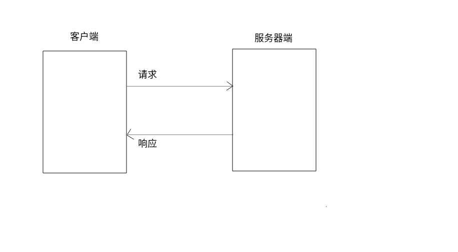

# HTTP协议概念

- Hyper Text Transfer Protocol 超文本传输协议

#### 特点

- 基于TCP/IP的高级协议
- 默认端口为80
- 基于请求/响应模型-一次请求对应一次响应
- 无状态-每次请求之间相互独立

#### 版本

- 1.0：每一次请求响应都会建立一个新的tcp连接
- 1.1：连接复用

#### 消息数据格式

- 请求
  - 请求方法
    - GET：请求参数在url后
      - 请求的url长度有限制
      - 安全性较低
    - POST：请求参数在请求体中
      - 请求的url长度没有限制
      - 安全性较高
  - 请求行
    - 请求方式 请求url 请求协议/版本
    - GET /xxx HTTP/1.1
  - 请求头：浏览器告知服务器的信息
    - 请求头名称: 请求头值
    - 常见请求头
      - User-Agent：访问服务器使用的浏览器以及系统信息。
      - Referer：请求来源
        - 防盗链
        - 统计
  - 请求空行
    - 空行，用于分隔POST请求的请求头和请求体
  - 请求体
    - 封装POST请求消息的请求体
    - 键=值
  - 字符串格式
  - Host: ss1.bdstatic.com
    User-Agent: Mozilla/5.0 (X11; Ubuntu; Linux x86_64; rv:71.0) Gecko/20100101 Firefox/71.0
    Accept: */*
    Accept-Language: zh-CN,zh;q=0.8,zh-TW;q=0.7,zh-HK;q=0.5,en-US;q=0.3,en;q=0.2
    Accept-Encoding: gzip, deflate, br
    Referer: https://www.baidu.com/
    Connection: keep-alive
- 响应
  - 响应行
    - 协议/版本 状态码 描述
    - 响应状态码
      - 1xx：服务器没有接收完消息
      - 2xx：成功
        - 200：成功
      - 3xx：重定向
        - 302：重定向
        - 304：访问缓存
      - 4xx：客户端错误
        - 404：路径错误not found
        - 405：请求方式错误
      - 5xx：服务器错误
        - 500：服务器异常
  - 响应头
    - 名称：值
    - 常见响应头
      - Content-Type：本次响应体数据格式及编码格式
      - Content-disposition：响应体数据格式
        - in-line：默认，在当前页面打开
        - attachment;filename=xxx：附件形式打开响应体，文件下载。
  - 响应空行
  - 响应体：数据
  - 字符串格式
  - HTTP/2.0 200 OK
    server: JSP3/2.0.14
    date: Sat, 28 Dec 2019 14:26:19 GMT
    content-type: application/javascript
    content-length: 5669
    content-encoding: gzip
    etag: "50d3-59736b0c0b240"
    last-modified: Wed, 13 Nov 2019 09:07:13 GMT
    expires: Sat, 10 Nov 2029 10:42:57 GMT
    age: 3901402
    accept-ranges: bytes
    cache-control: max-age=315360000
    vary: Accept-Encoding,User-Agent
    ohc-cache-hit: ty3un74 [4]
    ohc-response-time: 1 0 0 0 0 0
    X-Firefox-Spdy: h2
