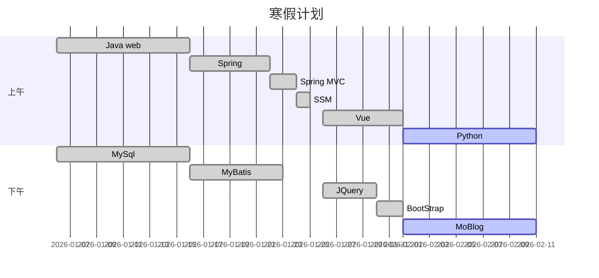

```mermaid
gantt
	dateFormat MM-DD
	 title 寒假计划
        section 上午
        Java web:done,des11, 01-06,10d
        Spring:done,des12, after des11, 6d
        Spring MVC:done,des13, after des12, 2d
        SSM:done, des14,after des13,1d
        Vue:done, des15, 01-26, 6d
        Python:active, des16, after des15, 10d
        section 下午
        MySql:done,des21, 01-06,10d
        MyBatis:done,des22, after des21, 7d
        JQuery:done, des23,01-26,4d
        BootStrap:done, des24, after des23, 2d
        MoBlog:active, des25, after des24, 10d
```

