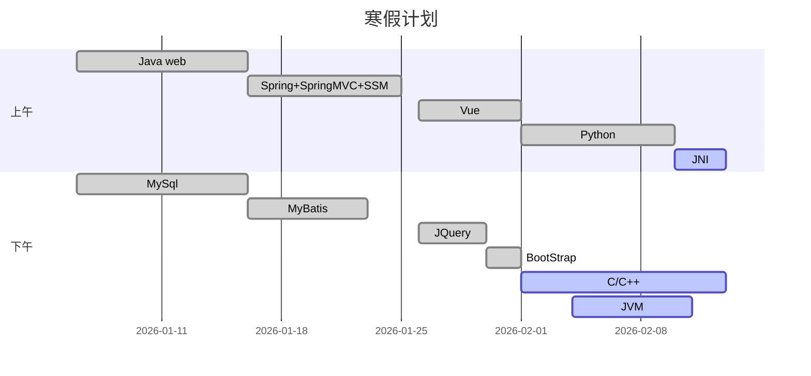

```mermaid
gantt
	dateFormat MM-DD
	 title 寒假计划
        section 上午
        Java web:done,des11, 01-06,10d
        Spring+SpringMVC+SSM:done,des12, after des11, 9d
        Vue:done, des15, 01-26, 6d
        Python:done, des16, after des15, 9d
        JNI:active, des17, after des16, 3d
        section 下午
        MySql:done,des21, 01-06,10d
        MyBatis:done,des22, after des21, 7d
        JQuery:done, des23,01-26,4d
        BootStrap:done, des24, after des23, 2d
        C/C++:active, des25, after des24, 12d
        JVM:active, des26, 02-04,7d
```

