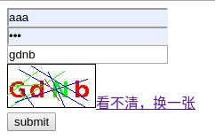
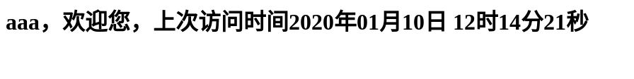

## java web原生验证码登录功能

#### 需求

- 实现验证码检查
- 登录跳转
- 错误提示

#### 实现流程

- 创建登录页面，使用表单提交

  - ```html
    <form action="login" method="post">
        <input id="usernameI" name="username" placeholder="user name" type="text"><br>
        <input id="passwordI" name="password" placeholder="pass word" type="password"><br>
        <input id="identcodeI" name="identcode" placeholder="ident code" type="text"><br>
        <a id="refesh" href="">看不清，换一张</a><br>
        <input id="submit" name="submit" value="submit" type="submit"><br>
    </form>
    ```

- js实现验证码刷新

  - ```js
    window.onload = function () {
            //点击图片时
            var img = document.getElementById("identcode");
            img.onclick = function () {
                refesh();
            }
    
            //点击连接时
            var a = document.getElementById("refesh");
            a.onclick = function () {
                refesh();
                //返回false防止a标签默认href行为
                return false;
            }
    
            function refesh() {
                /**
                 * 由于路径相同时浏览器会自动调用缓存中的图片
                 * 所以在连接后加时间戳解决此问题
                 */
                var date = new Date().getTime();
                img.src = "identcode?" + date;
            }
        }
    ```

- 创建loginServlet，实现登录接口

  - ```java
    //解决乱码
            req.setCharacterEncoding("utf-8");
            resp.setContentType("text/html;charset=utf-8");
            //获取参数
            String username = req.getParameter("username");
            String password = req.getParameter("password");
            String identcode = req.getParameter("identcode");
            System.out.println("u:"+username);
            System.out.println("p:"+password);
            System.out.println("i:"+identcode);
            //判断验证码
            //读取
            HttpSession session = req.getSession();
            String identcodese = (String) session.getAttribute("identcode");
            if (identcode.equalsIgnoreCase(identcodese)){
                //验证码正确
                User user = new User();
                if (password.equals(user.getPassword(username))){
                    //成功登录
                    System.out.println("登录成功");
                    //将数据写入session
                    session.setAttribute("username", username);
                    resp.setStatus(302);
                    resp.setHeader("location","home.jsp");
                }else{
                    //用户名密码错误
                    PrintWriter writer = resp.getWriter();
                    writer.write("用户名或密码错误");
                }
            }else{
                PrintWriter writer = resp.getWriter();
                writer.write("验证码错误");
            }
    ```

- 关于验证码生成

  - https://blog.csdn.net/qq_25884515/article/details/103885865

- 在home.jsp中检查是否登录，未登录跳转到登录页面

  - ```java
    //判断是否已登录
        String username = (String) session.getAttribute("username");
        if (username == null || username.equals("")){
            response.setStatus(302);
            response.setHeader("location", "index.jsp");
            return;
        }
    ```

#### 结果

.

