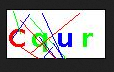
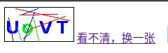
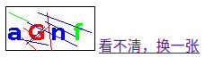

#### 验证码

- 防止恶意表单注册

#### 生成验证码图片

- 定义宽高

```java
int width = 100;
int height = 50;
```

- 使用BufferedImage再内存中生成图片

```java
BufferedImage image = new BufferedImage(width, height, BufferedImage.TYPE_INT_RGB);
```

- 绘制背景和边框

```java
Graphics g = image.getGraphics();
g.setColor(Color.WHITE);
g.fillRect(0, 0, width, height);
g.setColor(Color.BLACK);
g.drawRect(0, 0, width - 1, height - 1);
```

- 创建随机字符集和随机数对象

```java
//字符集
String str = "ABCDEFGHIJKLMNOPQRSTUVWXYZabcdefgjijklmnopqrstuvwxyz";

//随机数
Random ran = new Random();
```

- 创建随机颜色生成方法

```java
private Color getRandomColor(Random random) {
    //获取随机颜色
    int colorIndex = random.nextInt(3);
    switch (colorIndex) {
        case 0:
            return Color.BLUE;
        case 1:
            return Color.GREEN;
        case 2:
            return Color.RED;
        case 3:
            return Color.YELLOW;
        default:
            return Color.MAGENTA;
    }
}
```

- 绘制验证码字符

```java
//绘制验证码
for (int i = 0; i < 4; i++) {
    //获取随机字符
    int index = ran.nextInt(str.length());
    char ch = str.charAt(index);
    //获取随机色
    Color randomColor = getRandomColor(ran);
    g.setColor(randomColor);
    //设置字体
    Font font = new Font("宋体", Font.BOLD, height / 2);
    g.setFont(font);
    //写入验证码
    g.drawString(ch + "", (i == 0) ? width / 4 * i + 2 : width / 4 * i, height - height / 4);
}
```

- 绘制干扰线

```java
//干扰线
for (int i = 0; i < 10; i++) {
    int x1 = ran.nextInt(width);
    int x2 = ran.nextInt(width);
    int y1 = ran.nextInt(height);
    int y2 = ran.nextInt(height);
    Color randomColor = getRandomColor(ran);
    g.setColor(randomColor);
    g.drawLine(x1, x2, y1, y2);
}
```

- 使用ImageIO输出图片

```java
ImageIO.write(image, "jpg", resp.getOutputStream());
```

- 成果图

.

#### 实现刷新效果

- 新建html页面
- 使用img标签实现图片展示

```html

<a id="refesh" href="">看不清，换一张</a>
```

- 使用js实现刷新效果

```javascript
//点击图片时
var img = document.getElementById("identcode");
img.onclick = function (){
    refesh();
}

//点击连接时
var a = document.getElementById("refesh");
a.onclick = function (){
    refesh();
    //返回false防止a标签默认href行为
    return false;
}

function refesh() {
    /**
     * 由于路径相同时浏览器会自动调用缓存中的图片
     * 所以在连接后加时间戳解决此问题
     */
    var date = new Date().getTime();
    img.src = "identcode?" + date;
}
```

- 效果

.

.

#### 项目源码

https://github.com/xiaochen0517/StudySpace/tree/master/idea/TestDemo3

